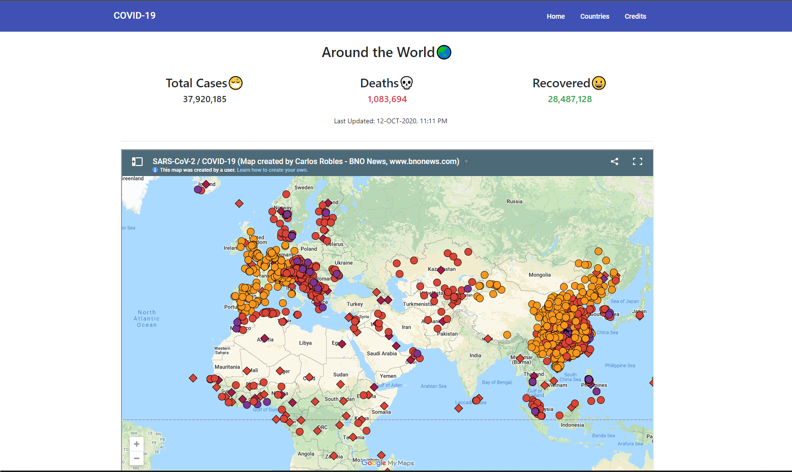

# Corona-Stats

<p>A small website to give latest information regarding Covid-19 using angular and 3rd Party API </p>

<p> Live Version: <a href="https://covidgo.netlify.app" target="_blank"> Click here 🚀</a></p>




## How to contribute

* (Optional but advisable) Create an issue if you find any bug or want to improve something
* Fork the repo
* Clone the repo to your local machine

 
```
git clone http://github.com/<YOUR-USERNAME>/corona-stats
```

* Install node_modules
```
npm install
```
* Run the project

```
ng serve -o
```
* Make meaningful changes and write a understandable commit message
* Push the changes and create a pull request


## Steps to host this angular app on Netlify:

<ol>
    <li>Goto netlify, click New Site From Git</li>
    <li>Select the repository you want to publish</li>
    <li>In build command, write <b>ng build --prod</b></li>
    <li>In publish directory, write <b>dist/corona-app</b></li>
    <li>Deploy</li>
</ol>

#### note: here in publish directory, you have to write "dist/project_name" which is 'corona-app' in this case, not 'corona-stats'
